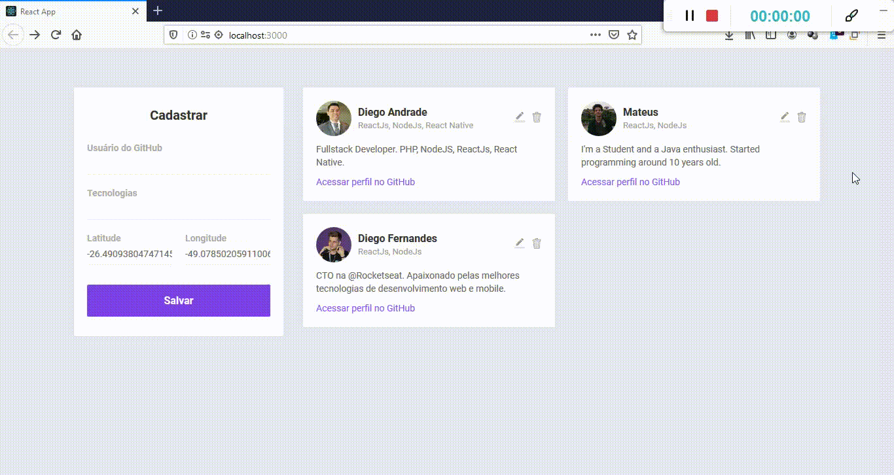
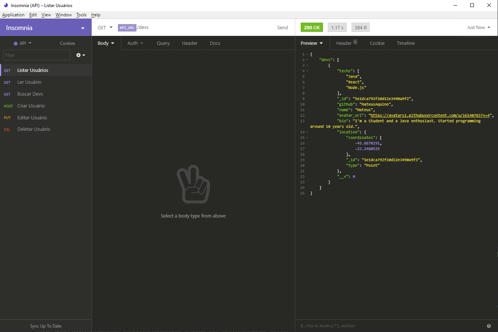

</img>
<h1 align="center">Omnistack Week 10</h1>
<p align="center">Project <strong>DevRadar</strong> developed during the Rocketseat OmniStack Week</p>

<p align="center">
  <a aria-label="NodeJs version" href="https://github.com/nodejs/node/blob/master/doc/changelogs/CHANGELOG_V12.md#12.14.1">
    </img>
  </a>
  <a aria-label="ReactJs version" href="https://github.com/facebook/react/blob/master/CHANGELOG.md#16120-november-14-2019">
    </img>
  </a>
  <a aria-label="Expo version" href="https://www.npmjs.com/package/expo-cli/v/3.11.5">
    </img>
  </a>
  <a aria-label="Chalenges" href="DESAFIOS.md">
  	</img>
  </a>
  <a aria-label="Completed" href="https://rocketseat.com.br/week-10/aulas#4">
    </img>
  </a>
</p>

## Instalation
Configure MongoDB and update the conexion string with your `User:Password` on file `index.js` .
To install the dependencies and to execute the **Backend** (developer mode), clone the project on your computer an execute:
```bash
cd backend
yarn install
yarn dev
```
To run the React's **Frontend** use:
```bash
cd frontend
yarn install
yarn start
```
When the process end, automatically will open the page `localhost:3000` on your web browser with de Project DevRadar.

To test the React Native **Mobile**, first put your server address (your computer) in the file`src/services/api.js`, and after execute the commands:
```bash
# Don't execute the following line if tou have the Expo (CLI) already intalled! 
yarn global add install expo-cli

cd mobile
yarn install
yarn start
```
When the proccess end, automatically will open the page `localhost:19002`. Connect your emulator, or test the app by `LAN`: Download the *Expo* app from Play Store or App Store and scan the QR Code.

## Backend
See more on [backend/README.md](./backend) about Backend informations.

## Frontend
See more on [frontend/README.md](./frontend) about Frontend informations. The Frontend developed with [chalenge](DESAFIOS.md) done, looks like that :

</img>

Run tha application at: https://devsarround.herokuapp.com/

## Mobile
The mobile app (React Native) developed with Sockets (+ the [chalenge](DESAFIOS.md) done) looks like that:

</img>

## Imnsonia 
To test the DevRadar API, download and install [Insomnia](https://insomnia.rest/download/) and click at Workspace → `Import/Export` →  
`Import Data` → `From File` → select the file ` 	Insomnia_export.json` of this repository. When finish, the result looks like that:

</img>

## Licence

[MIT](./LICENSE) &copy; [Rocketseat](https://rocketseat.com.br/)
